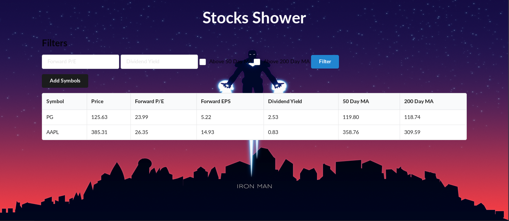

# Stocks_Shower

**Problem statement-**
- Need to use API
- create API
- Need to use Database (sqlite3)

**Solution-**
Created one simple Stocks Shower Web_App that shows the companies stocks value and store it in our database(sqlite3).

*Front-End :*
    - Semantic UI [To create front-end code]

*Back-End :*
    - FastApi [python]

*API :*
    - yfinace [ python lib that used to extract companies stock values]

    

